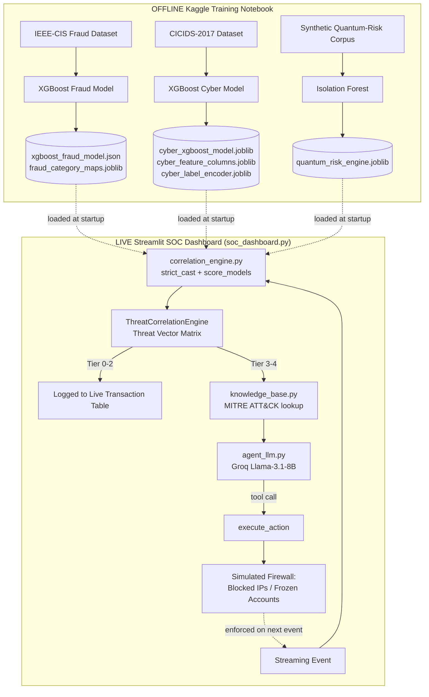

# QTT-Sheild -- AI-Driven Correlation Engine for Cybersecurity Telemetry & Transactional Behavior


**A real-time, multi-domain threat correlation platform for banking, fusing fraud analytics, network telemetry, and quantum-risk detection into a single autonomous SOC pipeline.**

### 🔗 Live Application
### **[https://bomteamlonewolf-mifalxzx3acfty59fun7jk.streamlit.app/](https://bomteamlonewolf-mifalxzx3acfty59fun7jk.streamlit.app/)**
### Video Folder
### **https://drive.google.com/drive/folders/15BRdURD27PFH-T125G9Ym9NdjtUTXvWJ?usp=drive_link**

---

## Table of Contents
1. [What This Project Is](#1-what-this-project-is)
2. [Tools & Technology Stack](#2-tools--technology-stack)
3. [System Architecture](#3-system-architecture)
4. [What Each File Does](#4-what-each-file-does)
5. [How This Solves the Problem Statement](#5-how-this-solves-the-problem-statement-scored-against-the-evaluation-rubric)
6. [Running It Locally](#6-running-it-locally)

---

## 1. What This Project Is

Modern bank fraud rarely lives in one system anymore. A credential-stuffing attack on the login API, a fraudulent wire transfer, and a slow encrypted data exfiltration ("harvest-now-decrypt-later"  steal encrypted data today, decrypt once quantum computing matures) can be **three views of the same incident**, seen by three teams who never talk to each other: the fraud desk, the SOC, and (increasingly) the crypto-risk team.

**QTT-Sheild (Quantum data-Telemetry data- Transaction Data SHEILD) fuses all three into one decision.** It runs three independent, purpose-built ML models over a single live event, refuses to average their outputs (a blended score would hide the exact pattern that matters  see [§5](#security-considerations--30)), and instead runs them through a **rule-based Threat Vector Matrix** that only escalates to a high tier when domains *agree*. A **tier-3+ decision is then handed to an LLM-driven SOC agent**, grounded in a MITRE ATT&CK-mapped knowledge base, which recommends and  in agentic mode  actually **executes** a containment action (freeze account / block IP / step-up auth), visible live in a Streamlit dashboard with a simulated firewall.

This is not a fraud-detection demo. It's an **incident-correlation and response layer** that sits on top of models a bank likely already has.

---

## 2. Tools & Technology Stack

| Layer | Technology | Why |
|---|---|---|
| Fraud model | **XGBoost** (binary classifier), trained on **IEEE-CIS Fraud Detection** dataset | Gradient-boosted trees remain the industry standard for tabular transaction fraud  fast, interpretable via feature importance, native categorical support |
| Cyber-telemetry model | **XGBoost** (5-class classifier), trained on **CICIDS-2017** | Real network-flow intrusion dataset (DoS Hulk/GoldenEye/Slowhttptest, FTP-Patator, Benign)  detects brute-force and DoS signatures from flow statistics |
| Quantum-risk model | **Isolation Forest** (unsupervised, scikit-learn) | No labeled "harvest-now-decrypt-later" data exists yet  anomaly detection over payload entropy/size/velocity is the only honest approach to an emerging threat class |
| Correlation logic | Custom Python **rule engine** (`ThreatCorrelationEngine`) | Deliberately not an ML model  the "AND/OR" logic between domains needs to be auditable by a bank's risk committee, not a black box |
| Reasoning & response | **Groq** (Llama 3.1 8B Instant) via tool-calling | Sub-second LLM inference is required to keep pace with a live transaction stream; tool-calling lets the model genuinely *act* (freeze/block) rather than just describe an action |
| Knowledge grounding | Static **MITRE ATT&CK**-mapped knowledge base (`knowledge_base.py`) | Forces the LLM to cite real technique IDs (T1078, T1020, T1110...) it retrieved, not ones it hallucinated from pretraining |
| Dashboard | **Streamlit** | Our dashboard named ##SenticalCore Fastest path from Python logic to a live, demoable, stakeholder-facing UI  no separate frontend build needed |
| Data wrangling | pandas, NumPy | Standard |
| Model persistence | joblib, XGBoost's native JSON serializer | Cross-environment model loading (train on Kaggle, serve on Streamlit Cloud) |
| Training environment | Kaggle Notebook + `gdown`/`kagglehub` | Free GPU/CPU compute + direct dataset pulls for CICIDS-2017 and the synthetic quantum-risk corpus |

---

## 3. System Architecture



**The one design decision that matters most:** scores are **never averaged**. A 40% fraud score and a 40% cyber score is not "40% risk"  it's two independent domains agreeing at a moderate level, which is itself a signal an average would erase. The matrix checks combinations (`high(fraud) AND high(cyber)` → Tier 4, `high(quantum) AND high(cyber)` → the quantum-harvest signature specifically) rather than blending numbers.

---

## 4. What Each File Does

| File | Role |
|---|---|
| **`notebookc42bda811a (3).ipynb`** | The offline training pipeline. Loads IEEE-CIS (fraud), CICIDS-2017 (cyber), and a synthetic quantum-risk corpus; trains the three models with anti-overfitting guardrails (regularization, early stopping, 5-fold CV, train/test AUC-gap checks); saves all six model artifacts consumed by the live app. |
| **`correlation_engine.py`** | The production scoring core. `strict_cast()` safely converts a single streaming JSON event into the exact dtype schema each XGBoost booster expects  handling nulls, unseen categories, and the pandas/XGBoost strict-categorical-validation edge cases that break naive casting. `ThreatCorrelationEngine.correlate()` implements the Threat Vector Matrix. `load_models()` / `score_models()` tie it together for the dashboard. |
| **`knowledge_base.py`** | A small, static lookup table mapping every possible `Context_Tag` the correlation engine can output (e.g. `MULTI_DOMAIN_CORRELATED_ATTACK`, `QUANTUM_HARVEST_CONFIRMED`) to a real MITRE ATT&CK technique ID/name and a bank-specific SOP line. This is what keeps the LLM grounded  it's instructed to cite *only* what's retrieved here. |
| **`agent_llm.py`** | The SOC reasoning layer. `analyze_threat()` is a constrained single-shot call to Groq that returns strict JSON (tactic, explanation, action, target). `analyze_threat_agentic()` is the more advanced path: a genuine tool-calling loop where the LLM can call `lookup_user_history()` for more context and must call `execute_action()` itself to actually perform containment  the action isn't inferred from text after the fact. **Every path has a deterministic, rule-based `fallback_response()`** if the API key is missing or the call fails, so the SOC never goes silent. |
| **`soc_dashboard.py`** | The Streamlit front end and the name of the dashboard is ##SentinalCore. Replays the event stream at an adjustable speed, scores each event, renders a live color-coded transaction table (red = Tier 3/4, amber = Tier 2), shows a running LLM alert feed with MITRE context, and  critically  **actually enforces** blocked IPs / frozen accounts against subsequent events in the same session, closing the loop from detection to response. |
| **`sample_stream_full_1000.json`** | The 1,000-event, 60-user, multi-scenario labeled stream (`NORMAL_BACKGROUND`, `FRAUD_TXN`, `DDOS`, `BRUTE_FORCE`, `EXFIL_HNDL`, `ACCOUNT_TAKEOVER`) used to validate and demo the whole pipeline end-to-end. |

---

## 5. How This Solves the Problem Statement (scored against the evaluation rubric)

### Business Potential & Relevance  
Cross-domain fraud is an acknowledged, growing blind spot: fraud, SOC, and risk teams run **separate tools that don't share a decision layer**, so a coordinated attack (steal credentials → drain account → exfiltrate data for later decryption) gets logged as three unrelated low-priority tickets instead of one Tier-4 incident. SentinelCore's entire value proposition is closing that gap *without* replacing any bank's existing fraud or SIEM stack  it's a correlation and response layer that sits on top of scores those systems already produce. The LLM agent then converts a tier into an **auditable, MITRE-cited action** in seconds, which is the actual bottleneck in most SOCs today (analyst triage time), not detection itself.

### Security Considerations  
- **No blended, hide-the-signal risk score.** The Threat Vector Matrix is fully auditable  a risk committee can read `if high(fraud) and high(cyber): Tier 4` and understand exactly why an account was frozen, which a single opaque ML score cannot offer.
- **Grounded LLM, not a hallucinating one.** `agent_llm.py` is instructed to cite MITRE technique IDs *only* from `knowledge_base.py`'s retrieval  never from memory  directly mitigating the single biggest risk of LLM-in-the-loop security automation (fabricated justifications for automated action).
- **Deterministic fallback on every LLM path.** If Groq is unreachable, misconfigured, or returns malformed JSON, `fallback_response()` guarantees a rule-based decision still fires. A SOC automation layer that goes silent when its LLM dependency fails is a security risk in itself; this one doesn't.
- **Real containment, not just alerting.** `execute_action` and `apply_firewall_action` genuinely block IPs and freeze accounts for the rest of the session  the dashboard demonstrates full detect → decide → contain, not detection alone.
- **Production-grade data handling.** `strict_cast()` was hardened against real-world schema failure modes: null-heavy columns reaching XGBoost as unsupported dtypes, and newer XGBoost's strict category validation rejecting inference-time categories the booster never saw in training. Both are the kind of silent failure that would otherwise let a malformed event crash  or worse, silently mis-score  a live fraud pipeline.

### Uniqueness of Approach & Solution  
Most fraud-detection submissions are "train one model, show a confusion matrix." SentinelCore instead treats fraud, network intrusion, and *quantum-era* data-harvesting as three parts of one adversary playbook, correlates them with an auditable rule matrix rather than an ensemble average, and closes the loop with an **agentic LLM that takes real action**, not just a chatbot summarizing an alert. The quantum-risk model in particular is forward-looking: "harvest-now-decrypt-later" is a real, named threat to long-lived encrypted financial data, and almost no student fraud project addresses it at all.

### User Experience  
The Streamlit dashboard is built for a SOC analyst's actual workflow: a live, color-coded transaction table (red/amber triage at a glance), a running alert feed with plain-English MITRE-grounded explanations instead of raw model scores, and one-click Start/Pause/Reset controls with an adjustable replay speed for both live demo and slow-motion investigation.

### Scalability  
Every component is stateless and file-driven: swap `sample_stream_full_1000.json` for a real Kafka/Kinesis event source and the same `score_models()`/`correlate()` call is per-event, no batch dependency. Model artifacts load once via `st.cache_resource`; adding a branch, region, or new model type is a new file path and a new key in `knowledge_base.py`, not a rearchitecture.

### Ease of Development & Maintenance  
Each domain model is trained, saved, and versioned independently in the notebook  retraining the cyber model doesn't touch the fraud or quantum pipeline. The correlation matrix, knowledge base, and LLM prompt are all plain, readable Python/dict literals (no config DSL to learn), so a new engineer can trace *exactly* why any given event was scored the way it was, top to bottom, without needing this README.

---

## 6. Running It Locally

```bash
git clone <this-repo>
cd BOM_Proj
pip install streamlit pandas numpy xgboost scikit-learn joblib groq python-dotenv

# Place the 6 model artifacts produced by the training notebook in this folder:
#   xgboost_fraud_model.json, fraud_category_maps.joblib,
#   cyber_xgboost_model.joblib, cyber_feature_columns.joblib, cyber_label_encoder.joblib,
#   quantum_risk_engine.joblib

# Set your Groq key for live LLM reasoning (optional  falls back gracefully without it)
echo "GROQ_API_KEY=your_key_here" > .env

streamlit run soc_dashboard.py
```
